# HMI Tag Analyzer

HMI Tag Analyzer is a Windows app for analyzing [SEL Diagram Builder](https://selinc.com/products/5035/) `.hprb` HMI
files for errors, namely invalid tag references and reused tags.

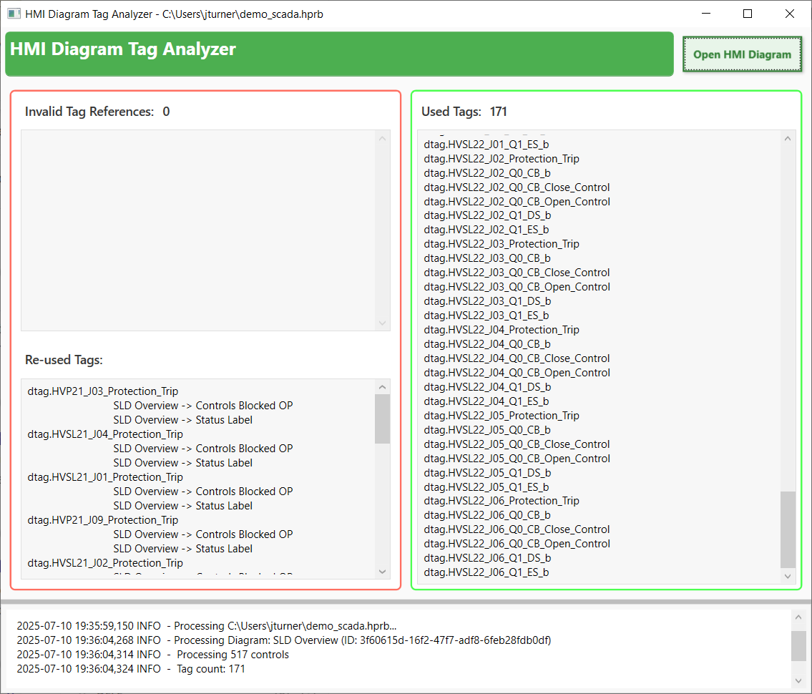

This project has no affiliation with SEL. SEL Diagram Builder is closed source, but some kind SEL engineer included an
API, which you will find in `c:\Program Files\SEL\AcSELerator\DiagramBuilder\bin\api\SEL.API.dll`, that I used for this
project.

## Background

HMIs? Tags??

In electrical substations, such as those [my brother's company](https://www.delengineering.com.au/) designs protection
settings for, operators need to understand what's going on with the many circuit breakers, transformers,
switches and busbars. So, on a computer somewhere, there runs the substation **HMI** ('human machine interface'). The
HMI is schematic representation of the substation. The HMI shows the voltage and current at various points, visually
depicts the state of circuit breakers and switches, and often has 'controls' that let an operator open or close circuit
breakers.

Here is the bottom half of a HMI for a substation:

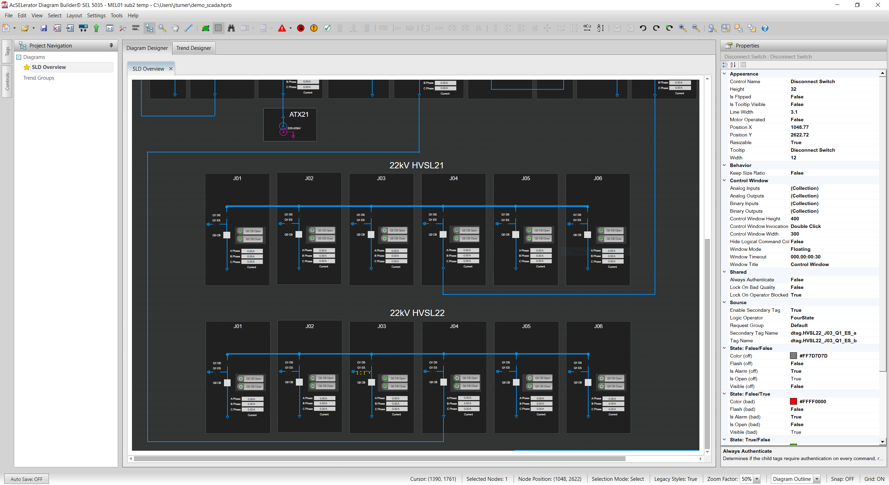.

You will notice there is a lot of repetition - e.g. between HVSLJ21 and HVSLJ22, and also between J1 through to J6.

Here I have zoomed in on HVSLJ21's J06, and also clicked A phase voltage. On the right you'll see the source of this
voltage - a labelled data point called a **tag**. This particular tag is `atag.HVSL21_J06_A_Phase_Current`:

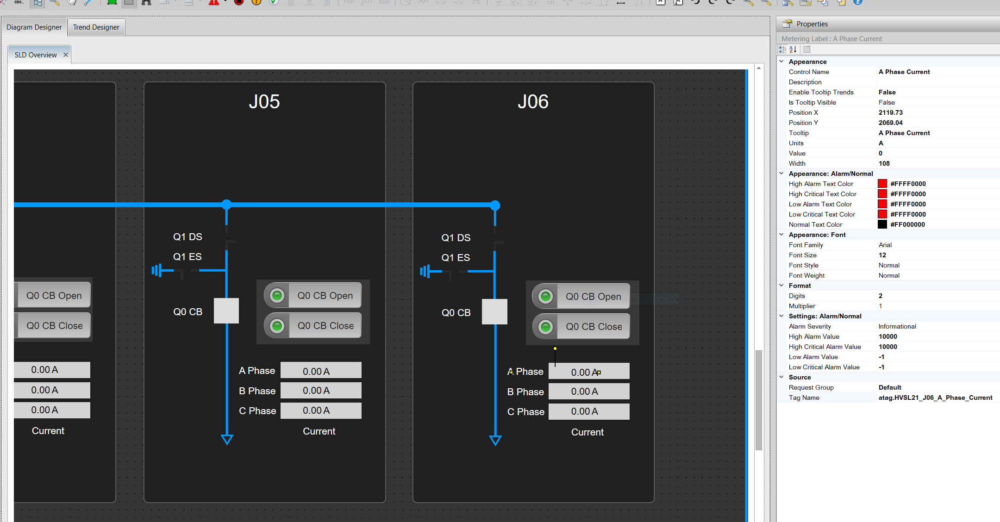

There are, all up, 12 tags used in just J06:

```angular2html
atag.HVSL21_J06_A_Phase_Current
atag.HVSL21_J06_B_Phase_Current
atag.HVSL21_J06_C_Phase_Current
dtag.HVSL21_J06_Q1_DS_a
dtag.HVSL21_J06_Q1_DS_b
dtag.HVSL21_J06_Q1_ES_a
dtag.HVSL21_J06_Q1_ES_b
dtag.HVSL21_J06_Protection_Trip
dtag.HVSL21_J06_Q0_CB_Open_Control
dtag.HVSL21_J06_Q0_CB_Close_Control
```

A HMI will typically contain hundreds of tags. All very alike. All hidden in the settings of graphical widgets. All set
one by one, by the HMI designer.

I hope you see the problem HMI designers face: **it is very easy to muck up the tags**. For instance:

- you forget to set a tag on a widget altogether
- you copy and paste (e.g. J05 to J06) and forget to alter all the tag names in your copy.
- your tags change (e.g. a tag is renamed upstream), and your widgets now refer to a non-existent tag.

There is no easy way (that I know of) to simulate tag values to let you see how your HMI responds. The only testing is
physical, during deployment (which is taken very seriously), and if this doesn't catch a mistake there could be very
real-world sparks-and-outages consequences.

## What the HMI Tag Analyzer does

The HMI Tag Analyzer takes a `.hprb` file, as generated by [SEL Diagram Builder](https://selinc.com/products/5035/), and
looks through all the tags used, and generates a tag usage report:


### Invalid tags

'Tags' are just named data points available to the HMI from its host computer, called an RTAC (real-time automation
controller). The HMI designer must import the tag set from the RTAC, often multiple times as new settings and tags are
created:

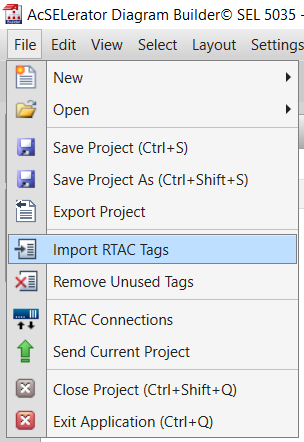

SEL Diagram Builder won't let you use a non-existent tag, if a tag changes its name or is deleted, your only indication
is a yellow ⊖ on the widget: 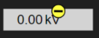

In the HMI Tag Analyzer, the **Invalid Tag References** section shows all such invalid tag references.

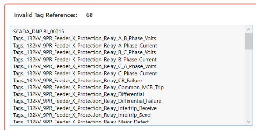

### Re-used tags

Consider J06 again:


Let's say J06 was copied from J05. The J06 A, B and C phase current tags are:

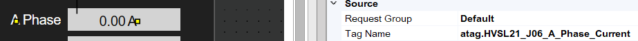

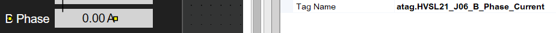

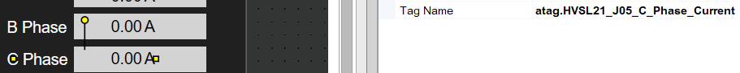

Do you see the mistake? C phase uses the `J05` tag rather than `J06`!

This mistake can be caught be carefully reviewing the **Re-used Tags** section:

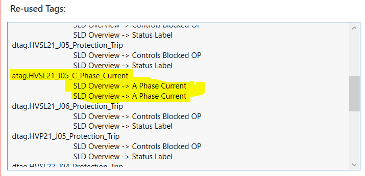

Many tags are legitimately used more than once -- for example, the `Protection_Trip` tags are used both in a label and
an opaque overlay to prevent an underlying control being used during a protection trip. But
`atag.HVSL21_J05_C_Phase_Current` should not be used more than once.

## Used Tags

The **Used Tags** list may be useful for comparing with the source of your tags, such as a spreadsheet. If a tag is in
your source spreadsheet, but not in **Used Tags**, then something is missing or wrong in the HMI.

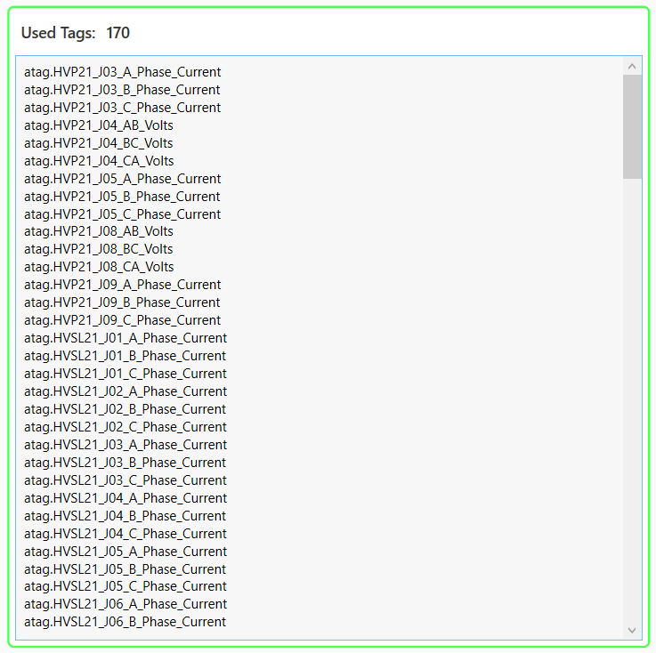

# Shortcomings

- Currently the app is cumulative, i.e. if you load `a.hprb` and then `b.hprb`, you will see tags for both files, and
  need to restart it to reset.
- This was my first C# project, written with autocomplete and ChatGPT. The code is terrible.